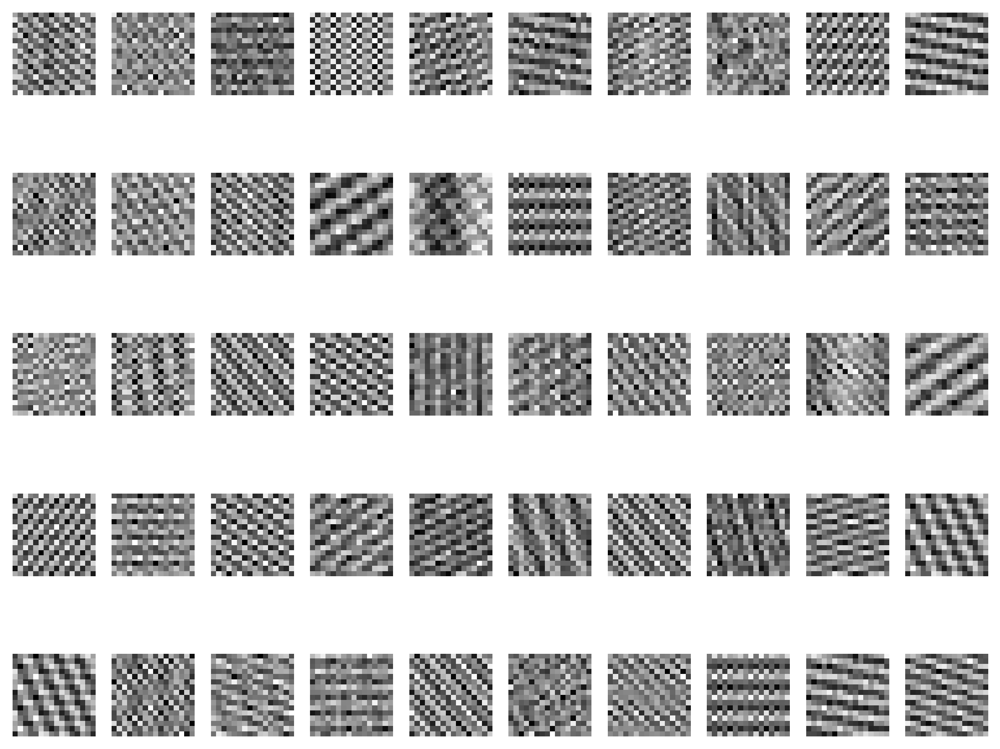

# olf-sparse-coding

## Overview

This repository contains a Python implementation of the sparse coding algorithm originally proposed by Olshausen and Field. The algorithm models how natural images can be represented efficiently using a small number of basis functions, mimicking aspects of early visual processing in the brain.

## Paper Reference

Olshausen, B. A., & Field, D. J. (1996). Emergence of simple-cell receptive field properties by learning a sparse code for natural images. *Nature*, 381(6583), 607–609.  
[https://www.nature.com/articles/381607a0](https://www.nature.com/articles/381607a0)

## 📚 Core Ideas in the paper

- The basis functions mentioned in Olhaussen and Field represent the core building blocks of an image.
- The sparse codes are instructions that represent linear combinations of these basis functions to recreate images
- The idea is that the basis functions span the entire image space it's given. The sparse codes are instructions that let you know which basis functions you need to combine in order to recreate any given image

### Example output: basis functions obtained from sample data
Here, the algorithm was run on a similiar dataset to the paper's figure 3b. The basis functions displayed below show that the algorithm has discovered features of images that exhibit some of the features that simple cells in the visual cortex have. As you can see, some of the basis functions are oriented - for instance, the ones that look like diagonals or edges. Depending on the run, it also shows spatially localized bases which look like zoomed in edges. 
<br></br>


## 🚀 Getting Started

### Requirements

- Python 3.7+  
- NumPy  
- Matplotlib  

### Installation

```bash
pip install -r requirements.txt
```

## Usage

Clone this repository:

```bash
git clone https://github.com/AmandaKwok28/olf-sparse-coding.git
cd olf-sparse-coding
```

To run the algorithm:
```bash
python sparse-coding.py
```

### Extending & Modifying
Currently, the input data is generated by simulating randomly activated components in the Fourier domain, following the approach illustrated in Figure 3b of the Olshausen and Field paper. You are encouraged to modify the helper functions located beneath the class definition to customize the input data according to your needs.

Please note that this implementation employs an iterative method for updating both the dictionary and sparse codes. This stochastic update strategy has been observed to yield improved convergence during training. While a matrix-based implementation was also developed, it demonstrates faster runtime but results in noticeably inferior performance. Therefore, it wasn't included in this repository.


